  
  &emsp;
  

# Notes & Posts
<!-- BLOG-POST-LIST:START -->
- [Heap Patterns](https://karnablog.netlify.app/DSA/heaps/patterns)
- [Circular Queue](https://karnablog.netlify.app/DSA/Queues/circual_queue)
- [Queues](https://karnablog.netlify.app/DSA/Queues/Queues)
- [Complexity Analysis](https://karnablog.netlify.app/DSA/Queues/complexity)
- [Monotonic Queue](https://karnablog.netlify.app/DSA/Queues/monotonic_queue)
- [Using Stacks](https://karnablog.netlify.app/DSA/Queues/stacks)
- [Heap](https://karnablog.netlify.app/DSA/heaps/heap)
- [Stack Patterns](https://karnablog.netlify.app/DSA/Stacks/Patterns)
- [Min Stack](https://karnablog.netlify.app/DSA/Stacks/min_stack)
- [Monotonic Stack](https://karnablog.netlify.app/DSA/Stacks/monotonic_stack)
<!-- BLOG-POST-LIST:END -->
